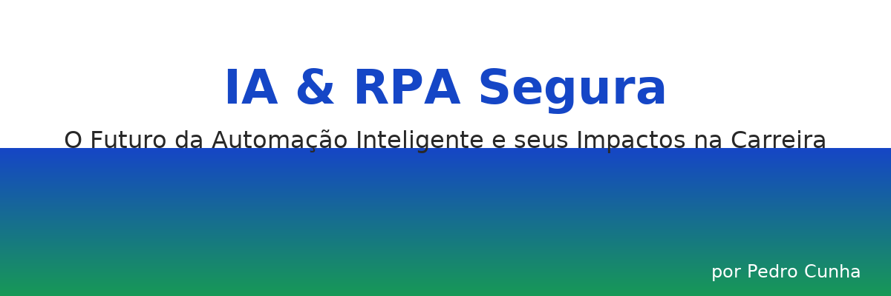
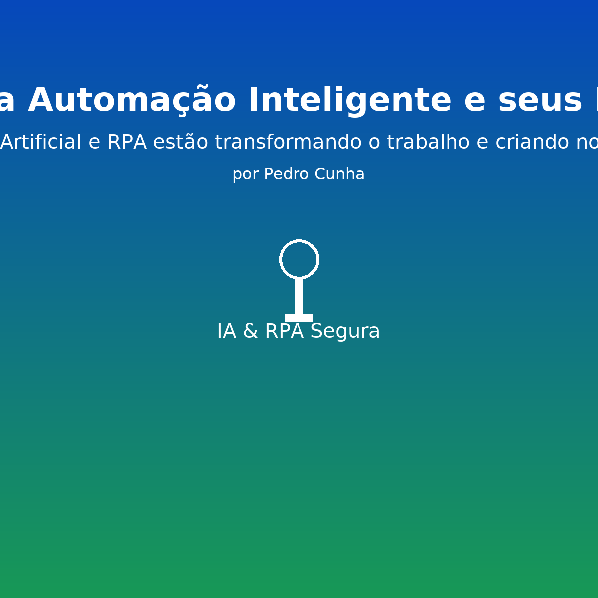

# 📗 IA & RPA Segura  
### O Futuro da Automação Inteligente e seus Impactos na Carreira  
#### _Como Inteligência Artificial e RPA estão transformando o trabalho e criando novas oportunidades_  
**por Pedro Cunha**

---



O **IA & RPA Segura** é um eBook que explora como a **Inteligência Artificial (IA)** e a **Automação Robótica de Processos (RPA)** estão transformando empresas, profissões e a forma como a tecnologia impulsiona o trabalho humano.

Este material foi criado com o objetivo de oferecer uma visão prática e inspiradora sobre os principais campos de aplicação, aspectos éticos, desafios de segurança e as novas oportunidades de carreira que surgem com a automação inteligente.

---

## 🧱 Estrutura do Repositório
```
ebook-ia-rpa-segura/
├─ README.md
├─ prompt.txt
├─ ebook.md
├─ assets/
│  ├─ capa.png
│  ├─ sumario.png
│  └─ graficos/
├─ chapters/
│  ├─ 01-introducao.md
│  ├─ 02-o-que-e-ia-e-rpa.md
│  ├─ 03-campos-de-aplicacao.md
│  ├─ 04-etica-e-seguranca.md
│  ├─ 05-impactos-na-carreira.md
│  ├─ 06-oportunidades-de-futuro.md
│  └─ 07-conclusao.md
└─ scripts/
   ├─ generate_cover.py
   └─ generate_pdf.py
```

---

## 🧠 Conteúdo do E-book

- **1. Introdução:** contexto e objetivos  
- **2. O que é IA e RPA:** conceitos e convergência  
- **3. Campos de Aplicação:** setores que mais se beneficiam  
- **4. Ética e Segurança:** princípios e boas práticas  
- **5. Impactos na Carreira:** novas funções e certificações  
- **6. Oportunidades de Futuro:** hiperautomação e IA generativa  
- **7. Conclusão:** próximos passos e mindset de aprendizado contínuo  

---

## ⚙️ Como gerar o PDF A4

1️⃣ Crie um ambiente virtual e instale as dependências:
```bash
python -m venv .venv
.venv\Scripts\activate  # Windows
pip install -r requirements.txt
```

2️⃣ Gere a capa (opcional — já incluída):
```bash
python scripts/generate_cover.py
```

3️⃣ Gere o PDF final (~30 páginas):
```bash
python scripts/generate_pdf.py
```

O arquivo **`ebook-ia-rpa-futuro-automacao.pdf`** será criado na raiz.

---

## 🧩 Tecnologias
- **Python 3.10+**
- **ReportLab** – geração do PDF  
- **Pillow (PIL)** – manipulação de imagens  
- **Markdown** – estrutura e conteúdo  

---

## ✍️ Autor
**Pedro Cunha**  
*IA & RPA Segura – Um olhar prático sobre o futuro da automação inteligente.*

> ✳️ _"IA e RPA não substituem o profissional — potencializam quem une tecnologia, processo e ética."_  
> — **Pedro Cunha – IA & RPA Segura**

---
